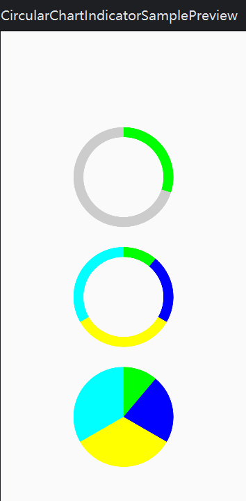
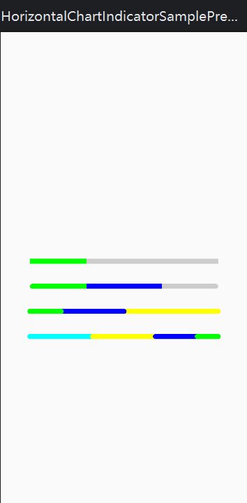
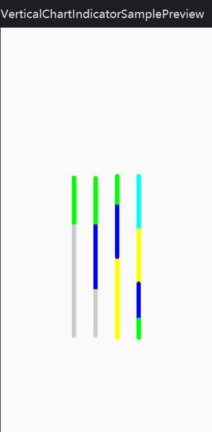
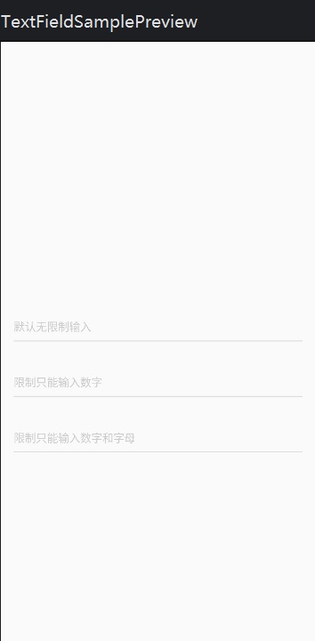
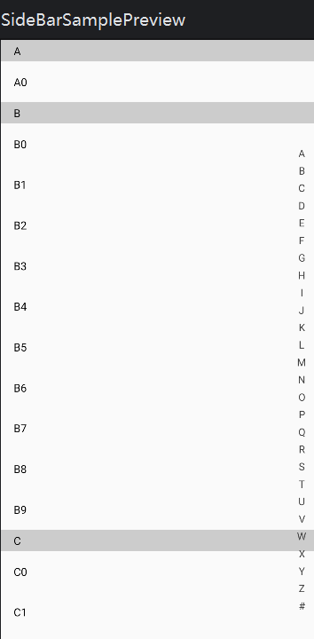

# Compose Component

[](https://raw.githubusercontent.com/jenly1314/compose-component/master/app/release/app-release.apk)
[](https://repo1.maven.org/maven2/com/github/jenly1314/compose-component)
[](https://jitpack.io/#jenly1314/compose-component)
[](https://circleci.com/gh/jenly1314/compose-component)
[](https://android-arsenal.com/api?level=21)
[](https://opensource.org/licenses/mit-license.php)
[](https://jenly1314.github.io/)
[](http://shang.qq.com/wpa/qunwpa?idkey=8fcc6a2f88552ea44b1.1.982c94fd124f7bb3ec227e2a400dbbfaad3dc2f5ad)

compose-component 是一个Jetpack Compose的组件库；主要提供了一些小组件，便于快速使用。

## Gif 展示


> 你也可以直接下载 [演示App](https://raw.githubusercontent.com/jenly1314/compose-component/master/app/release/app-release.apk) 体验效果

## 引入

### Gradle:

1. 在Project的 **build.gradle** 或 **setting.gradle** 中添加远程仓库

    ```gradle
    repositories {
        //...
        mavenCentral()
    }
    ```

2. 在Module的 **build.gradle** 里面添加引入依赖项

    ```gradle
    implementation 'com.github.jenly1314:compose-component:1.0.0'
    ```

## 使用说明

compose组件的使用大都比较直观，一般只需看一下 **Composable** 函数对应的入参就基本就会使用了。

> 如果通过入参还是没太看懂怎么用的，你也可以通过直接看下面各个组件对应的代码示例来加深理解。

### 组件说明

这里列一下目前 **compose-component** 所包含的一些组件，方便快速查找。

| 组件名称                     | 组件说明        | 使用示例                                                                                                       |
|:-------------------------|:------------|:-----------------------------------------------------------------------------------------------------------|
| CircularChartIndicator   | 圆形图表指示器     | [代码示例](app/src/main/java/com/king/compose/component/app/component/chart/CircularChartIndicatorSample.kt)   |
| HorizontalChartIndicator | 水平图表指示器     | [代码示例](app/src/main/java/com/king/compose/component/app/component/chart/HorizontalChartIndicatorSample.kt) |
| VerticalChartIndicator   | 垂直图表指示器     | [代码示例](app/src/main/java/com/king/compose/component/app/component/chart/VerticalChartIndicatorSample.kt)   |
| TextField                | 文本输入框（正则限制） | [代码示例](app/src/main/java/com/king/compose/component/app/component/text/TextFieldSample.kt)                 |
| SideBar                  | 字母索引侧边栏     | [代码示例](app/src/main/java/com/king/compose/component/app/component/bar/SideBarSample.kt)                    |

### 组件示例效果图








> 后续会根据需求场景，不定期补充各种小组件。

更多使用详情，请查看[app](app)中的源码使用示例或直接查看 [API帮助文档](https://jitpack.io/com/github/jenly1314/compose-component/latest/javadoc/)

## 版本记录

#### v1.0.0：2023-9-3

* compose-component初始版本

## 赞赏

如果您喜欢compose-component，或感觉compose-component帮助到了您，可以点右上角“Star”支持一下，您的支持就是我的动力，谢谢 :
smiley:<p>
您也可以扫描下面的二维码，请作者喝杯咖啡 :coffee:
<div>

</div>

## 关于我

Name: <a title="关于作者" href="https://jenly1314.github.io" target="_blank">Jenly</a>

Email: <a title="欢迎邮件与我交流" href="mailto:jenly1314@gmail.com" target="_blank">
jenly1314#gmail.com</a> / <a title="给我发邮件" href="mailto:jenly1314@vip.qq.com" target="_blank">
jenly1314#vip.qq.com</a>

CSDN: <a title="CSDN博客" href="http://blog.csdn.net/jenly121" target="_blank">jenly121</a>

CNBlogs: <a title="博客园" href="https://www.cnblogs.com/jenly" target="_blank">jenly</a>

GitHub: <a title="GitHub开源项目" href="https://github.com/jenly1314" target="_blank">jenly1314</a>

Gitee: <a title="Gitee开源项目" href="https://gitee.com/jenly1314" target="_blank">jenly1314</a>

加入QQ群: <a title="点击加入QQ群" href="http://shang.qq.com/wpa/qunwpa?idkey=8fcc6a2f88552ea44b1411582c94fd124f7bb3ec227e2a400dbbfaad3dc2f5ad" target="_blank">
20867961</a>
   <div>
       
       
   </div>